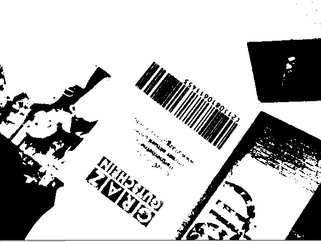
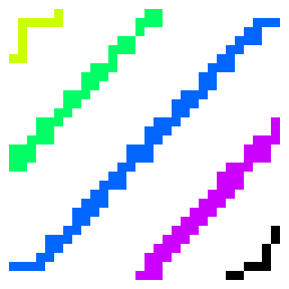
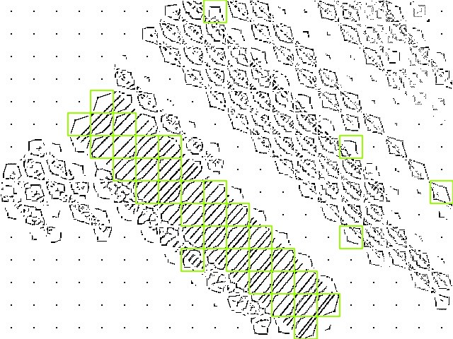
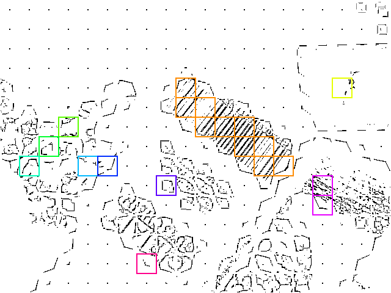
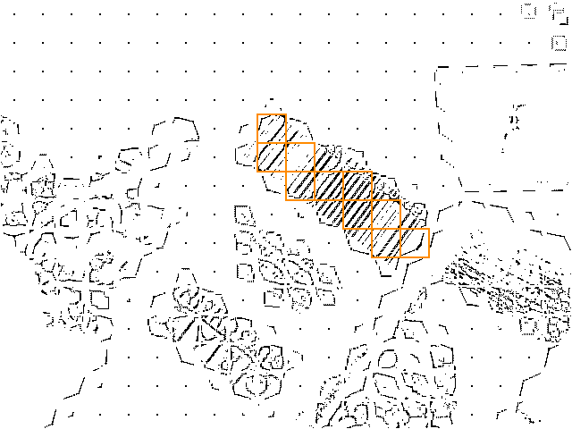
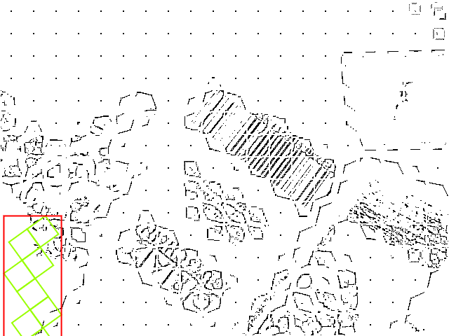

# How Barcode Localization Works {#how-barcode-localization-works}

> **Note on Terminology**: "Localization" in this context refers to finding the **physical location** (position, bounding box) of a barcode within an image - not language localization (i18n). This is standard computer vision terminology.

This article explains the technical details of how Quagga2 locates and decodes barcodes in images. Understanding this can help you optimize performance and troubleshoot issues.

## Overview {#overview}

Quagga2 uses a two-stage process:

1. **Barcode Locator** (blue box in the images below) - Finds regions that look like barcodes
2. **Barcode Decoder** (red line in the images below) - Reads the actual barcode data

This approach is based on the paper [Locating and decoding EAN-13 barcodes from images captured by digital cameras](http://www.icics.org/2005/download/P0840.pdf) by Douglas et al., with adaptations and modifications for web browsers.

## Stage 1: Barcode Locator {#stage-1-barcode-locator}

The locator finds patterns that look like barcodes. A barcode is typically characterized by:

- **Lines** (black bars and white gaps)
- That are **close to each other**
- With a **similar angle** (parallel lines)

### Step 1: Creating a Binary Image {#step-1-binary-image}

The first step is converting the color image to binary (black and white). Instead of using a simple threshold (e.g., everything below 127 is black), Quagga2 uses **Otsu's method**, which adapts to lighting changes across the image.

Otsu's method analyzes the image histogram and automatically separates foreground (barcode) from background, even with uneven lighting.

### Step 2: Slicing into a Grid {#step-2-slicing-grid}

The binary image is divided into a **20×15 grid** (assuming 4:3 aspect ratio). Each cell is analyzed independently to determine if it contains barcode-like patterns.

### Step 3: Extract Skeleton {#step-3-extract-skeleton}

Each cell undergoes **skeletonization** - reducing bars to their centerline (1px width). This is done through iterative erosion and dilation.

The skeleton clearly shows where parallel lines exist, making it easier to identify barcode regions.

### Step 4: Component Labeling {#step-4-component-labeling}

Using **connected-component labeling**, each line in the skeletonized image is separated into individual components. This is done with a fast algorithm based on the paper ["A Linear-Time Component-Labeling Algorithm Using Contour Tracing Technique"](http://www.iis.sinica.edu.tw/papers/fchang/1362-F.pdf) by Fu Chang et al.

Each color represents a distinct labeled component (line). Notice how each cell is processed independently.

Here are zoomed examples of two cells:

*Good: Parallel lines indicate a possible barcode*

*Bad: Random components indicate noise/text*

### Step 5: Determining Orientation {#step-5-determining-orientation}

For each component, Quagga2 calculates its orientation using **central image moments**. This is a mathematical technique to extract the angle of a shape.

The orientation (θ) is calculated as:

Where μ (mu) are central moments calculated from raw moments (M):

The centroid (x̄, ȳ) is calculated from raw moments:

And the raw moments (M) are computed as:

Where I(x,y) is the pixel value at position (x,y) - either 0 or 1 in a binary image.

Don't worry if the math looks intimidating - the key insight is that these formulas calculate **which direction each line is pointing**.

### Step 6: Determining Cell Quality {#step-6-determining-cell-quality}

Cells are evaluated based on how parallel their lines are:

1. **Filter out noise**: Discard cells with fewer than 2 components, or components smaller than 6 pixels
2. **Cluster angles**: Group similar angles together
3. **Select dominant cluster**: Pick the cluster with the most members
4. **Quality threshold**: Only accept cells where ≥75% of components share the same angle

Cells that pass this test are called **patches** and contain:

- Unique index
- Bounding box
- All components with their angles
- Average angle
- Direction vector

Yellow boxes show patches that were classified as possible barcode areas. Note some false positives (text regions).

### Step 7: Finding Connected Cells {#step-7-finding-connected-cells}

Patches are grouped together if they're neighbors with similar orientation (within 5% angle difference). This is done using recursive component labeling.

Each color represents a distinct group. Sometimes adjacent patches have different colors due to angle differences exceeding the 5% threshold.

### Step 8: Selecting Groups {#step-8-selecting-groups}

Groups are sorted by size (number of patches) and only the largest groups are kept - these are most likely to be actual barcodes.

Small groups and false positives have been filtered out.

### Step 9: Create Bounding Box {#step-9-create-bounding-box}

For each group, a **minimum bounding box** is calculated:

1. Calculate average angle of all patches in the group
2. Rotate all patches by this angle
3. Find outermost corners (min/max x and y)
4. Create bounding box
5. Rotate box back to original orientation

*Patches rotated to horizontal, bounding box calculated*

*Final bounding box rotated back to match barcode orientation*

The bounding box now precisely outlines the barcode, including its rotation and scale. This information is passed to the decoder.

## Stage 2: Barcode Decoder {#stage-2-barcode-decoder}

With the bounding box and orientation known, the decoder:

1. Samples pixel intensities along scan lines within the box
2. Detects transitions from black to white (edges of bars)
3. Calculates bar widths
4. Matches patterns against the selected barcode format(s)
5. Validates checksums
6. Returns the decoded data

## Why This Approach? {#why-this-approach}

Unlike simpler barcode scanners that require the barcode to be:

- Horizontal (aligned with the viewport)
- At a specific distance (scale)
- Centered in the frame

Quagga2's localization algorithm is **invariant to rotation and scale**. It can find and decode barcodes:

- At any angle
- At any size (within reason)
- Anywhere in the image
- Even with multiple barcodes present

This makes it much more practical for real-world camera scanning where users can't always position the camera perfectly.

## Performance Considerations {#performance-considerations}

The localization algorithm is computationally intensive. Key factors affecting performance:

- **Image size**: Smaller images process faster. Consider downscaling if speed is critical.
- **Grid size**: The default 20×15 grid balances accuracy and speed
- **Patch filtering**: Aggressive filtering reduces false positives but may miss difficult barcodes
- **Number of readers**: Enabling multiple barcode formats increases decode time

See [Optimize Performance](../how-to-guides/optimize-performance.md) for practical tips.

## Related Reading {#related-reading}

- **Original Paper**: [Locating and decoding EAN-13 barcodes from images captured by digital cameras](http://www.icics.org/2005/download/P0840.pdf)
- **Otsu's Method**: [Wikipedia - Otsu's method](http://en.wikipedia.org/wiki/Otsu%27s_method)
- **Skeletonization**: [Wikipedia - Morphological skeleton](http://en.wikipedia.org/wiki/Morphological_skeleton)
- **Component Labeling**: [Wikipedia - Connected-component labeling](http://en.wikipedia.org/wiki/Connected-component_labeling)
- **Image Moments**: [Wikipedia - Image moment](http://en.wikipedia.org/wiki/Image_moment#Central_moments)
- **Fast Labeling Algorithm**: [A Linear-Time Component-Labeling Algorithm (PDF)](http://www.iis.sinica.edu.tw/papers/fchang/1362-F.pdf)
- **CodeProject Implementation**: [Connected Component Labeling and Vectorization](http://www.codeproject.com/Tips/407172/Connected-Component-Labeling-and-Vectorization)

## Source Code {#source-code}

The localization algorithm is implemented in:

- `src/locator/barcode_locator.js` - Main locator logic
- `src/locator/skeletonizer.js` - Skeletonization algorithm (asm.js)
- `src/common/cluster.js` - Clustering algorithms
- `src/common/cv_utils.js` - Computer vision utilities

Contributions and improvements are welcome!
